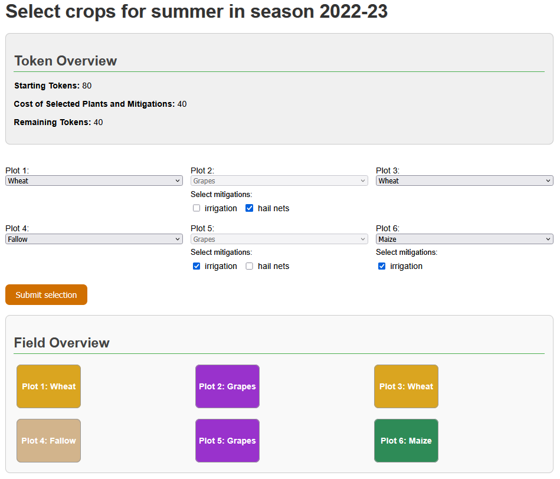

<h1>
  
  Farm or Fallow
</h1>

A web-based serious game for climate data interpretation and agricultural decision-making.



## About the Project

This repository contains the code for **"Farm or Fallow"**, a game that was digitalized and further developed as part of a Bachelor's thesis. It is based on the analog game of the same name, which was created as part of the EU-funded project [I-CISK](https://icisk.eu/about-icisk/).

### What is Farm or Fallow?

In Farm or Fallow, players must make decisions for agricultural fields based on real climate data. Depending on the weather conditions at the chosen location, the yield of the fields changes. The game playfully teaches how climate variability affects agriculture and which strategies can be used for risk management.

### New Features in this Version

- **Digitalization**: Complete implementation as a web application
- **Location Independence**: Free choice of location across Europe
- **Real-time Data**: Integration of real climate data via API

## Technology

- **Backend**: Flask (Python 3.11)
- **Frontend**: HTML, CSS, JavaScript
- **Climate Data**: Open-Meteo API

## Prerequisites

- Python 3.11 or higher
- pip (Python Package Manager)
- Firefox (recommended - other browsers not yet tested)

## Installation

### 1. Clone the Repository

```bash
git clone https://github.com/lraeuschel/farm-or-fallow.git
cd farm-or-fallow
```

### 2. Create a Virtual Environment (recommended)

```bash
python -m venv venv

# Windows
venv\Scripts\activate

# macOS/Linux
source venv/bin/activate
```

### 3. Install Dependencies

```bash
pip install -r requirements.txt
```

## Usage

### Starting the Server

```bash
python run.py
```

The server will start at `http://127.0.0.1:5000/`

### Playing the Game

1. Open your web browser
2. Navigate to `http://127.0.0.1:5000/`
3. Follow the game instructions


## Gameplay

Players manage agricultural fields across multiple seasons (winter and summer rounds). Based on climate forecasts and historical data, you must decide which crops to plant and whether to implement risk mitigation strategies.

- **Goal**: Maximize your yield across all rounds
- **Number of Rounds**: At the moment season 2022-23 and 2023-24 are playable

## Project Structure

```
farm-or-fallow/
├── app/
│   ├── data/                    # Game data and climate data
│   ├── static/                  # CSS, logo, generated plots
│   ├── templates/               # HTML templates
│   ├── __init__.py
│   ├── game_logic.py            # Game logic and calculations
│   ├── get_all_data.py          # API calls for climate data
│   └── routes.py                # Flask routes
├── docs/                        # Images for the README
├── .gitignore
├── README.md
├── requirements.txt
├── run.py                       # Server startup file
└── structure.txt
```

## Development

### Generating Requirements

If new dependencies have been added:

```bash
pip freeze > requirements.txt
```

## Context: Bachelor's Thesis

This game was developed as part of a Bachelor's thesis in Geoinformatics at the University of Münster.

**Author**: Lukas Räuschel  
**Year**: 2025

## Credits

- **Original Game**: Farm or Fallow (I-CISK Project)
- **EU Project**: [I-CISK](https://icisk.eu/about-icisk/)
- **Digitalization**: [lraeuschel](https://github.com/lraeuschel)

## License

The code in this repository (digital implementation) is available under the MIT License - see the [LICENSE](LICENSE) file for details.

**Note**: This is a digitalized version of the analog game "Farm or Fallow" from the [I-CISK project](https://icisk.eu/about-icisk/). The original game concept and materials belong to the I-CISK project partners. This implementation was created for educational purposes as part of a Bachelor's thesis.

## Contact

For questions or feedback:

- **GitHub Issues**: https://github.com/lraeuschel/farm-or-fallow/issues
- **Email**: l.raeuschel@uni-muenster.de

---

*Developed with ❤️, thanks to everyone in room 352 for the constant mental support*